# Architecture

The Graph Notification uses the following components:

1. Microsoft 365 Graph API
1. Azure SignalR Services
1. Azure Functions
1. Azure Redis, to store subscription information
1. Azure EventHubs
1. Azure AD for Authentication and Authorization with Access Tokens

A high level schema of the architecture is shown in below diagram:

## Create SignalR Connection

## Request Subscription

Flow to request a subscription for a Graph Resource. Assuming the step before is done with requesting access-token and creating SignalR connection

## Receive Change Notification

Assuming the step before is done with requesting access-token, creating SignalR connection and creating a subscription.

Below sequence diagram in case of a new chat message.

## Subscription Renewal

Graph subscriptions have a limited expiration time see [Link](https://docs.microsoft.com/en-us/graph/api/resources/subscription?view=graph-rest-1.0#maximum-length-of-subscription-per-resource-type). A subscription need to be renewed when it is expired. The expiration time will be record in the subscription record and a process will regularly check on expiration. When a subscription is about to expire the client is notified and need to extend the subscription.

The creation and renewal is the same for a client and same payload can be sent to subscription creation endpoint. See subscription creation about for the flow.

If a subscription renewal is sent too late by the client, the subscription can already be expired. This results in a ResourceNotFound error return by Graph API. This exception is captured and a "SubscriptionRenewalFailed" message with SubscriptionId is sent to the clients. The clients can decide how to handle  the exception. In case of the client in this repo, the subscription is removed from the client cache and timer to renew is stopped.

## Class Diagram Graph Notification Broker Server

```mermaid
    classDiagram
        GraphNotificationHub..>AppSettings
        GraphNotificationHub..>SubscriptionDefinition
        GraphNotificationHub..>SubscriptionRecord
        GraphNotificationHub..>IGraphNotificationService
        GraphNotificationHub..>ICertificateService
        GraphNotificationHub..>ICacheService
        GraphNotificationHub..>TokenValidationService
        CacheService<|..ICacheService
        CacheService..>IRedisFactory
        SubscriptionRecord<|--SubscriptionDefinition
        CertificateService<|--ICertificateService
        GraphClientService<|--IGraphClientService
        GraphNotificationService<|--IGraphNotificationService
        GraphNotificationService..>ICertificateService
        GraphNotificationService..>IGraphClientService
        TokenValidationService<|--ITokenValidationService
        TokenValidationService..>TokenValidationResult
        RedisFactory<|--IRedisFactory
        class GraphNotificationHub{
            Negotiate()
            +OnConnected() SignalRTrigger
            +CreateSubscription() SignalRTrigger
            +Run() EventHubTrigger
            +GetChatMessageFromNotification() HttpTrigger
            -GetAccessToken() string?
            -GetGraphSubscription(): SubscriptionRecord
            -GetGraphSubscription(): SubscriptionRecord
            -GetGraphSubscription(): SubscriptionRecord
        }
        class AppSettings{
            +string TenantId
            +string NotificationUrl
            +string ClientId
            +string ClientSecret
            +string KeyVaultUrl
            +string CertificateName
            +string UserAssignedClientId
            +string RedisConnectionString
            +bool UseClientSecretAuth
        }
        class SubscriptionDefinition{
            +string Resource
            +DateTimeOffset ExpirationTime
            +string[] ChangeTypes
            +bool ResourceData
        }
        class SubscriptionRecord{
            +string subscriptionId
        }
        class ICertificateService{
            <<interface>>
            GetEncryptionCertificate() Task~X509Certificate2~
            GetDecryptionCertificate() Task~X509Certificate2~
        }
        class CertificateService{
            <<service>>
            +GetEncryptionCertificate() Task~X509Certificate2~
            +GetDecryptionCertificate() Task~X509Certificate2~
            -GetCredential() TokenCredential
            -LoadCertificates() Task
        }
        class IGraphNotificationService{
            <<interface>>
            GetSubscriptionAsync() Task~Subscription~
            AddSubscriptionAsync() Task~Subscription~
            RenewSubscriptionAsync() Task~Subscription~
        }
        class GraphNotificationService{
            <<service>>
            GetSubscriptionAsync() Task~Subscription~
            +AddSubscriptionAsync() Task~Subscription~
            +RenewSubscriptionAsync() Task~Subscription~
        }
        class IRedisFactory{
            <<interface>>
            GetCache() IDatabase
            ForceReconnect()
            -CreateMultiplexer() Lazy<IConnectionMultiplexer>
            -GetDatabase() Lazy<IDatabase>
            -CloseMultiplexer()
        }
        class RedisFactory{
            <<service>>
            GetCache() IDatabase
            ForceReconnect()
             CreateMultiplexer() Lazy<IConnectionMultiplexer>
            -GetDatabase() Lazy<IDatabase>
            -CloseMultiplexer()
            Dispose
        }
        class IGraphClientService{
            <<interface>>
            GetUserGraphClient GraphServiceClient?()
        }
        class GraphClientService{
            <<service>>
            +GetUserGraphClient GetUserGraphClient?
        }
        class TokenValidationResult{
            +string Upn
            +string TenantId
            +string AppId
            +IList~Claim~ Claims
        }
        class ITokenValidationService{
            <<interface>>
            ValidateAuthorizationHeaderAsync() Task~TokenValidationResult?~
            ValidateTokenAsync() Task~TokenValidationResult?~
        }
        class TokenValidationService{
            <<service>>
            +ValidateAuthorizationHeaderAsync() Task~TokenValidationResult?~
            +ValidateTokenAsync() Task~TokenValidationResult?~
            -GetTokenValidationParametersAsync() Task~TokenValidationParameters?~
            -GetClaims() IList~Claim~
        }
        class ICacheService{
            <<interface>>
            AddAsync Task<bool>
            GetAsync Task<T>
            DeleteAsync Task<bool>
        }
         class CacheService{
            <<Service>>
            AddAsync Task<bool>
            GetAsync Task<T>
            DeleteAsync Task<bool>
        }
```

## Required Permissions

Requesting subscription for a Resource via Microsoft Graph requires the right permissions. In this solution the backend function requests an Access-Token on-behalf-of the user. It will exchange the Access-Token received from the the client application and exchanges it for an Access-Token for the Graph API. This requires that that the associated Azure Add Application is allowed to deliver Access-Token with desired permissions (scopes). In this solution and in the initial deployment the following permissions are defined.

> Chat.Read

To add additional permissions for your own deployment you add these permissions in the file CreateAppRegistrations.ps1. Alternatively you can add the permissions after deployment via the Azure Portal or a script to the backend application.
